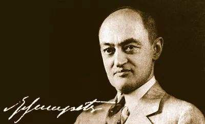

Title: 作为科学的经济学的发展阶段
Date: 2020-09-29 08:10
Category: 研究
Tags: economics, development

# 经济学是科学吗？

这个标题好像有点可笑，经济学就是经济科学的简称，既然如此，经济学是科学也就是勿容置疑的了。但知乎上不断
有同样的问题被提出，不少经济学者也专门为此作澄清，如此看来疑惑是有现实基础的。知乎上的提问者如此问：

>在过去十几年里，世界经历了金融危机、次贷危机等经济危机；世界上有那么多经济学家，可是在危机爆发之前，
>竟然几乎没有经济学家预测到这些危机，事后他们却说得头头是道，把危机的原因结果分析得清清楚楚，为什么他们
>早不知道？
>经济学的各种理论真的能指导我们的经济行为，特别是一个国家的宏观经济活动？

答者大抵会从有人的参与，造成经济行为的不可预知，甚至认为经济学如果能够用来指导经济实践，反说明经济学不是
科学，只是技术云云。（参见文献[1]）

那么，经济学作为科学，其内涵和发展阶段究竟如何呢？

任何一本经济学教材，开篇都会谈到经济学的定义。手边有本，托马斯·索维尔的《经济学的思维方式》，第一章也不
免俗，引用如下：

> 杰出的英国经济学家莱昂内尔·罗宾斯（Lionel Robbins）曾给出了经济学的一个经典定义：
> 经济学是研究具有不同用途的稀缺资源使用的学问。

作者还进一步阐述：

>经济学不仅是一个用来表达意见或发泄情绪的话题。它是对因果关系的系统研究，揭示以特定方式做特定事情时会造成
>何种结果。在经济分析中，奥斯卡·兰格（Oskar Lange）等马克思主义经济学家所使用的分析方法，与米尔顿·弗里德曼
>（Milton Friedman）等保守主义经济学家所使用的方法，并没有根本的不同。

可见，经济学也是离不开实证的。事实上，按照波普尔的观点，可证伪正是所有科学的本质特征。

# 科学发展的一般规律

科学研究活动有它内在的层次规律，不同层次和影响因子间存在一定的关系，但是也有些特例。研究的层次可以分为：
（1）素材型；（2）点突破型；（3）一般规律突破型。

* 素材型，是该科学研究仅仅为科学共同体提供一定的科研素材。
* 点突破型，是在某一领域某个点上取得了突破。
* 一般规律突破型，是基于一定的科学研究数据，提取出一般规律。

这三者不是完全绝对的，他们之间是一个循环关系，如一般规律得到突破后，就可以建立数学模型，转变成科学工具，
进而称为一个素材研究。工具也会在点突破研究提供基础。通过多个突破点进行归纳分析，又会有新的一般规律发现。

总之，科学的目的最终是改造世界，在没有达到一般规律突破前，科研活动就没有达到最终目的，科研活动需要科研共
同体的共同协作，减少重复，不断突破，才能不断促进技术进步！

# 经济学史上的6次革命

[近现代西方经济学理论发展历史上的六次革命](https://bbs.pinggu.org/jg/jingji_xifangjingjixue_1578896_1.html)

# 经济学演化的认知内涵

[从人的认识过程来说人类的经济学可以分为四个阶段](https://bbs.pinggu.org/thread-384749-1-1.html)

# 小结

经济学还正在进化中，现在还不能像物理学指导工业实践一样用以指导经济活动实践。

-----------
【参考文献】

1. 经济学是不是一门伪科学？,知乎，[EB/OL] https://www.zhihu.com/question/36948540，20200929

2. 经济学是科学吗？,知乎，[EB/OL] https://www.zhihu.com/question/20172519，20200929

3. 托马斯·索维尔，经济学的思维方式，[EB/OL] http://dushu.baidu.com/pc/reader?gid=4308784827&cid=20546540，20200929
