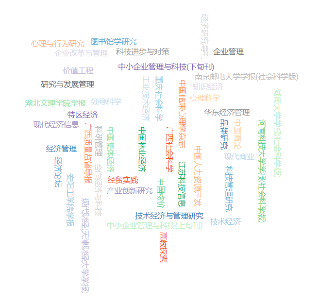
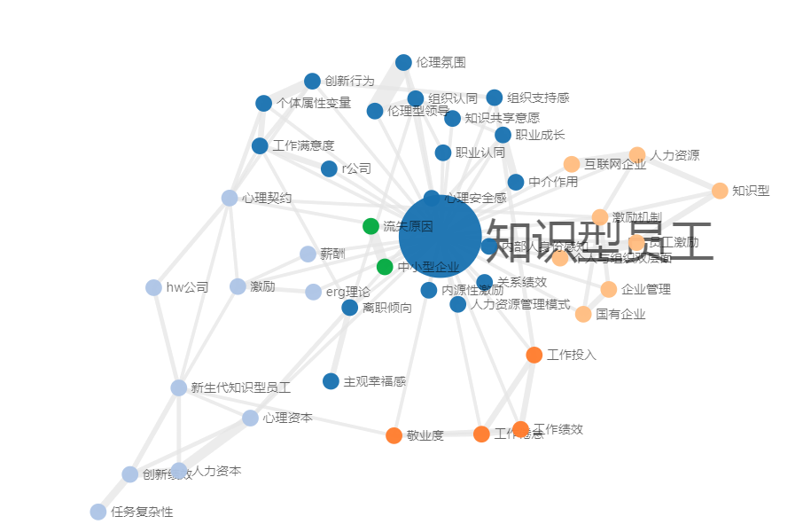

Title: 知识工作者 (knowledge worker)
Date: 2020-09-21 16:10
Category: 研究

作为一位旁观者，一位社会生态学家，德鲁克发现，当一个人拥有越来越多的知识，越来越具有独立自主的能力时，都不喜欢被管。
德鲁克在50年代已留意到我们管理的员工和从前的体力劳动者有所不同，所以他提出了一个新的专有名词 knowledge worker（知识工作者）。

"知识工作者"一词最早是由德鲁克在1959年其所著《明天的里程碑》中提出,彼得·德鲁克定义“知识工作者是那些掌握、运用符号和概念,利用
知识或信息工作的人",其含义是"把自己从学校学到的知识而非体力或体能投入工作,从而得到工资的人"。他预言知识工作者将成为社会劳动的
主体,这一新型的群体日益受到学者和企业界人士的广泛关注。知识工作者与传统的所谓"蓝领工人"的最大区别是:前者思考的是如何做正确的事
情,而后者则只需要学会如何正确地做事情。

德鲁克针对知识工作者的管理体系，强调组织的目标管理与知识工作者的自我控制。认为要给员工足够的资源，让他完成自己的目标，从而实
现部门的目标，当部门的目标实现之后，就可以支撑整个组织的目标，而这个目标的源头就来自于企业的使命。这种想法 无疑是理想的，但其
中忽略了人性中贪图安逸享受的一面。在现实中，仅仅如此是难以行得通的。

国内将知识工作者常称为“知识型员工”，知识型员工作为诸多生产要素中唯一具有主动性的生产要素,他们在人数上不断的增加,已成为推动经
济社会发展中不可忽视的力量。从企业生存发展来看,知识型员工已成为企业成败的重要因素，对知识型员工的管理构成了企业管理的核心部分。
如何根据知识型员工的特点,有效管理知识型员工,激发起知识型员工的积极性和创造性,增强知识型员工对企业的认同感与自豪感,提高知识型
员工的工作效率,是企业生存与持续发展的重要问题。

对知网以“知识型员工”为关键词搜索得到的近三年高被引文献，主要来源期刊包括《技术经济与管理研究》、《科技管理研究》等，选取搜索结
果中的前60篇文献作了统计分析和可视化呈现：

* 高频来源期刊

* 关键词共现网络

  
  
关键词共现网络

【参考文献】

[1]禹航.90后员工离职趋向——工作满意度研究文献综述[J].广西质量监督导报,2019(11):49-51.

[2]周霞,赵冰璐.晋升机会缺失对知识型员工角色内绩效的影响:内部人身份感知与知识共享氛围的作用[J].科技管理研究,2019,39(06):142-147.

[3]赵金金,刘博.职场排斥与知识型员工职业倦怠的曲线关系:心理授权和集体主义导向的调节作用[J].现代财经(天津财经大学学报),2019,39(03):101-113.

[4]董建华,高英.知识型员工工作投入的影响机制研究——基于组织公平视角[J].技术经济与管理研究,2019(02):65-69.

[5]沈茜,陈祉怡,李想.基于双因素理论的新生代员工激励研究综述[J].经济研究导刊,2019(06):127-129.

[6]吕景胜,庄泽宁,黄宏伟.知识型员工过度劳动对离职倾向的影响研究——基于工作满意度中介作用的分析[J].中国物价,2019(01):77-80.

[7]刘选会,张丽,钟定国.高校科研人员自我认同与组织认同和科研绩效的关系研究[J].高教探索,2019(01):17-23.

[8]王忠,陈晗,黄倩倩.知识型员工工作重塑量表开发研究[J].科技进步与对策,2019,36(02):118-125.

[9]徐千,高雪冬,康凯,苏雪华.领导—成员交换对知识型员工关系绩效的影响——工作嵌入的中介作用[J].技术经济,2018,37(12):45-52+60.

[10]李婷.基于心理契约的企业知识型员工激励机制构建研究[J].现代商业,2018(35):54-56.

[11]周霞,李铁城.职业召唤能否带来员工的创新?  知识型员工职业召唤对创新行为的影响——组织支持感的调节作用[J].科技管理研究,2018,38(23):123-130.

[12]马述杰. 薪酬公平、员工敬业度与工作绩效关系研究[D].山东大学,2018.

[13]熊正德,姚柱,张艳艳.人力资本、社会资本和心理资本对新生代知识型员工创新绩效影响研究——基于工作满意度的中介和工作特征的调节[J].湖南大学学报(社会科学版),2018,32(06):79-87.

[14]蔺晓芸.国有企业激励机制的现存矛盾分析及其发展思路探究[J].特区经济,2018(11):74-76.

[15]鲍春晓.基于工作特性理论的新生代知识型员工激励策略研究[J].现代商业,2018(29):51-53.

[16]柯江林,王娟.工作超载对工作满意度的影响效应及其调节变量[J].中国临床心理学杂志,2018,26(05):975-980.

[17]蔡宝清,李中斌.知识型员工工作满意度实证研究——以R公司为例[J].经济论坛,2018(10):122-130.

[18]刘博,赵金金.工作自主性对知识型员工越轨创新行为与职业倦怠的影响研究——基于角色压力及组织自尊的作用[J].南京邮电大学学报(社会科学版),2018,20(05):63-74.

[19]叶龙,赵迪,郭名.知识型员工职业呼唤对工作幸福感的影响研究——职业承诺的中介作用和薪酬的调节作用[J].中国人力资源开发,2018,35(09):29-39.

[20]任志云.国有企业知识型员工流失的研究[J].中小企业管理与科技(上旬刊),2018(09):9-10.

[21]仵凤清,高林,董宇华.知识型员工沉默行为对职业生涯成功的影响研究[J].科研管理,2018,39(08):142-150.

[22]郎晓波.知识型员工流失的原因及处理对策分析[J].经贸实践,2018(15):244.

[23]徐杭雁.新生代知识型员工软性激励机制构建[J].合作经济与科技,2018(16):102-105.

[24]刘培琪,刘兵,李嫄.授权型领导对知识型员工知识分享意愿的影响——基于社会信息加工的视角[J].技术经济,2018,37(07):81-87+98.

[25]骆正清,钱楚.高绩效工作系统对新生代员工创新绩效影响[J].华东经济管理,2018,32(08):163-168.

[26]赵敏.心理契约研究综述[J].安阳工学院学报,2018,17(05):53-57.

[27]王栋.基于个人和组织双层面的知识型员工知识共享的激励研究[J].价值工程,2018,37(22):113-116.

[28]谢雅萍,沈淑宾,陈睿君.越休闲越激情?——休闲参与对知识型员工工作激情的影响机制研究[J].经济管理,2018,40(07):128-145.

[29]曹圣伟.“互联网+”时代下企业人力资源管理创新研究[J].中国集体经济,2018(22):113-114.

[30]杜佳婧,李敏.自恋型领导与知识型下属创新绩效的关系研究[J].研究与发展管理,2018,30(03):55-63.

[31]张前. 从人力资源管理模式角度改善国有企业知识型员工忠诚度研究[D].西南交通大学,2018.

[32]郝红艳. 职业生涯早期知识型员工职业成长与离职倾向关系研究[D].河北工程大学,2018.

[33]王淼. D公司薪酬体系优化设计[D].北京交通大学,2018.

[34]张明.新生代知识型员工敬业行为的组织驱动因素分析[J].领导科学,2018(14):42-44.

[35]王玉峰,李丹.谦卑型领导对知识型员工职业成长的影响研究——反馈寻求行为的中介作用[J].广西社会科学,2018(05):87-93.

[36]卢佩言.基于心理契约维度的知识型员工激励机制研究——以A公司为例[J].中国商论,2018(14):185-186.

[37]刘金培,朱磊,倪清.组织氛围如何影响知识型员工敬业度:基于工作倦怠的中介效应研究[J].心理与行为研究,2018,16(03):394-401.

[38]任志娟,陶润生,胡中慧.组织职业生涯管理对知识型员工职业成长的影响——组织支持感的中介作用[J].湖北文理学院学报,2018,39(05):48-52.

[39]郭恬,林凤.基于ERG理论的知识型员工激励研究[J].中国林业经济,2018(03):108-111.

[40]伍文生.国内新生代知识型员工激励问题研究综述[J].江苏科技信息,2018,35(12):17-19+32.

[41]程茜,张颖,李鋆,樊凌霄.基于霍兰德职业测试对新生代知识型员工激励机制的研究[J].中小企业管理与科技(下旬刊),2018(04):30-31.

[42]张恬瑜,李婵,徐龙顺,史珍珍,王素丽.基于心理契约视角的新生代知识型员工绩效管理研究——以HW公司为例[J].河南科技大学学报(社会科学版),2018,36(02):91-97.

[43]廉串德,刘视湘,韩圣.知识型员工职业成功的影响因素[J].重庆社会科学,2018(04):56-63.

[44]梁文洁.分析新媒体时代时尚品牌的营销策略[J].品牌研究,2018(02):51+53.

[45]王雅茹,吴杲,王晓,吴尘.知识型员工的工作不安全感:影响及控制手段[J].科技管理研究,2018,38(07):186-194.

[46]肖志雄,聂天奇.知识型员工的心理距离与知识共享意愿关系的实证研究[J].图书馆学研究,2018(06):92-101.

[47]王娟.互联网企业知识型员工激励策略研究[J].技术经济与管理研究,2018(03):78-82.

[48]周勇,金文文.知识型企业新员工组织认同对知识共享绩效的影响研究[J].企业管理,2018(03):119-121.

[49]周霞,王亚丹.强制性公民行为对知识型员工离职倾向的影响研究:一个有调节的中介模型[J].科技管理研究,2018,38(05):159-165.

[50]孙涛.新生代知识型员工激励因素研究[J].现代经济信息,2018(05):86.

[51]陈丹.文化企业知识型员工激励机制研究[J].企业改革与管理,2018(04):79-80+108.

[52]蒋丽芹,胥永倩,张迪.伦理型领导、组织认同与知识型员工情感承诺的关系——伦理氛围的调节作用[J].工业技术经济,2018,37(02):82-90.

[53]张婧.国有企业知识型员工流失问题分析及对策探讨[J].知识经济,2018(04):88-89.

[54]王亮,牛雄鹰.知识型员工的组织支持感对其建言行为的影响[J].技术经济,2018,37(01):26-33.

[55]王永跃,张玲.心理弹性如何影响员工创造力:心理安全感与创造力自我效能感的作用[J].心理科学,2018,41(01):118-124.

[56]朱静.中小型企业知识型员工流失原因及管理对策分析[J].产业创新研究,2018(01):75-77.

[57]刘凯,侯冬玥.浅析我国企业知识型员工的薪酬激励[J].现代商业,2018(02):99-101.

[58]黄利梅.企业知识型员工激励边际递减效用的优化策略探究[J].技术经济与管理研究,2018(01):20-23.

[59]蒋明华,帅建华.知识型员工离职意愿消减行为研究——基于多变量视角下的模型构建与实证研究[J].技术经济与管理研究,2018(01):46-53.

[60]潘贞宇.基于知识型人力资源的激励机制研究[J].经贸实践,2018(02):241.

[61]知网知识元：知识型员工，https://qa.cnki.net/web/query?q=知识型员工.

[62]读德鲁克：这一句话，是老板最无能的表现,杜绍基,正和岛, [EB/OL] https://www.sohu.com/a/383673443_228668, 2020-03-27.
